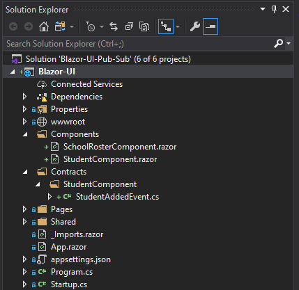

# BlazorComponentBus
Enables loosely coupled messaging between Blazor Components.

## Install BlazorComponentBus

Install the [BlazorComponentBus](https://www.nuget.org/packages/BlazorComponentBus) nuget package to your Blazor Server project.
    
    Install-Package BlazorComponentBus

Or via the .NET Core command line interface:

    dotnet add package BlazorComponentBus

Either commands, from Package Manager Console or .NET Core CLI, will download and install Blazor Component Bus.

## Setup
In your .NET Core app add the following line to make the ComponentBus available for use in your code.

    public void ConfigureServices(IServiceCollection services)
    {
        ...
        services.AddScoped<ComponentBus>();
    }

Next you will need to create message types. These are simple class files that can contain properties for passing information along with your to and from each component. The classes/objects are the messages that will be sent. The messages are the contracts that can be referenced by the components. The best practice is to create a contracts or messages folder for containg your messages.

An alternative approach would be to put your components and message contracts into separate projects.

An example message might look like this:

    public class StudentAddedEvent
    {
        public Guid StudentId { get; set; }
    }

## Subscribe to a message type

Blazor Components you want to react to a specific message must subscribe to that type of message. In the example above the **SchoollRosterComponent** would subscribe to the **StudentAddedEvent**. 

To subscribe to an event/message you must call Bus.Subscribe() and pass the message type, and a method you want called whenever a message of that type is published.

    @inject BlazorComponentBus.ComponentBus Bus

    
Body of the SchoolRosterComponent

    
    @code
    {
        protected override void OnInitialized()
        {
            //Subscribe Component to Specific Message
            Bus.Subscribe(typeof(StudentAddedEvent), (sender, e) => StudentAddedHandler(e));
        }

        private void StudentAddedHandler(MessageArgs args)
        {
            var message = args.GetMessage<StudentAddedEvent>();

            var id = message.StudentId;

            ...Do Something
        }

    }

## Publish a message

To publish a message you must call the Bus.Publish() method and pass in the message you want to send. In the example above the **StudentComponent** might publish a **StudentAddedEvent** when a new student form was filled out.

    @inject BlazorComponentBus.ComponentBus Bus

    <h3>StudentComponent</h3>

    @code {

        public void SendItOutThere()
        {
            Bus.Publish(new StudentAddedEvent{StudentId = new Guid()});
        }
    }